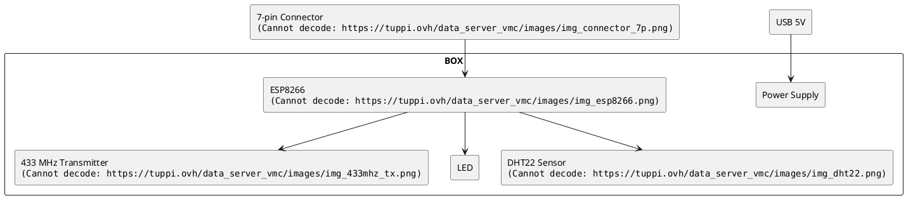
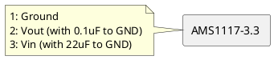
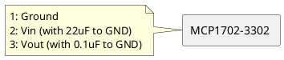
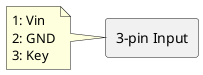

*Last update on 20/05/2021*

# Continuous Mandatory Ventilation

## Introduction

The idea of this project is to automize the speed regulation of Continuous Mandatory Ventilation (VMC) regarding a relative humidity. 

The built module makes these things:

- gets measurements from a humidity sensor, 

- receives commands from a simple HTTP server via wifi, 

- sends measurements to a database via wifi,

- controls the VMC relays regarding a measured humidity.


## Modules



### Power Supply

A component used to make a 3V3 stable voltage is AMS1117-3.3:



If it's necessary to power the module from battery, you should see the MCP1702-3302 with a low quiescent current:



A 3-pin connector is used to connect the input voltage with the board:



### DHT22

To be completed.

### ESP8266

To be completed.

### 7-Pin Connector

Pin  &nbsp; &nbsp; &nbsp; | Name  &nbsp; &nbsp; &nbsp; &nbsp; &nbsp; &nbsp; &nbsp; &nbsp; | Wire Color
------|------|------
1 | GND | Black
2 | RX | White
3 | Reserved\* | - 
4 | TX | Yellow
5 | Boot by GPIO0\*\* | Green 
6 | N.C. | -
7 | N.C. | -

*\* Reserved: Compatibility another project*  
*\*\* Boot by GPIO0: N.C. – Flash boot, GND – UART boot*  


## Boards Changelog

### v2.0 - WIFI Connection & Debug Connector

PCB:


### v1.1 - Low Consumption Temperature Sensor

Changelog vs v1.0:

- Changed the supply component from AMS1117 to MCP1702.

- Added a 7-pin connector. 

- Integrated 9V battery directly in the box.

- Removed LED and 433 MHz transmitter.

### v1.0 - Initial Version without WIFI Connection


## Configuration File

It is necessary to create a `config.h` file with this content:
```c
#ifndef CONFIG_H
#define CONFIG_H

/* Wifi */
const char * CONFIG_WIFI_SSID = <your-wifi-ssid>;           
const char * CONFIG_WIFI_PASSWORD = <your-wifi-password>;  

/* DIO identification number of 26 bits, you can choose a random number */
const uint32_t CONFIG_DIO_ID = <int>;

/* deep sleep in sec after each humidity regulation */ 
const int32_t CONFIG_SLEEP_EACH_ITER_S = 30; 

/* number of deep sleeps before connection to wifi to download / upload information */
const int32_t CONFIG_FORCE_UPDATE_ITER_NB = 60; 

/* mysensors node id (see MySensors documentation for more information) */
const int32_t CONFIG_MYSENSORS_NODE_ID = <int>;

/* mysensors IP address */
const char * CONFIG_MYSENSORS_IP = "<int>.<int>.<int>.<int>";  

#endif
```

## Source Code 

Source code of this project: 

- [https://github.com/tuppi-ovh/data-server-vmc](https://github.com/tuppi-ovh/data-server-vmc)

- [https://github.com/tuppi-ovh/data-server-pi](https://github.com/tuppi-ovh/data-server-pi)


## Links

- Datasheet MCP1702: [http://ww1.microchip.com/downloads/en/devicedoc/22008e.pdf](http://ww1.microchip.com/downloads/en/devicedoc/22008e.pdf)


