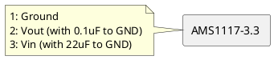
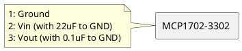
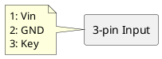

*Last update on 10/05/2020*

# Continious Mecanical Ventilation

## Introduction

The idea of this project to authomize the speed regulation of Continious Mecanical Vetilation (VMC) regarding a relative humidity. 

The built module makes these things: 

- gets measurements from a humidity sensor, 

- receives commands from a simple HTTP server via wifi, 

- sends measurements to a database via wifi,

- controls the VMC relays relays regarding humidity.

## Modules

```plantuml
@startuml
rectangle "BOX" as M_BOX {

    rectangle "433 MHz Transmitter" as M_433MHz
    note right
    <img:https://tuppi.ovh/data_server_vmc/images/img_433mhz_tx.png{scale=0.5}>
    end note

    rectangle "Power Supply" as M_POW
    note right
    NONE
    end note 

    rectangle "ESP8266" as M_ESP8266
    note right
    <img:https://tuppi.ovh/data_server_vmc/images/img_esp8266.png{scale=0.5}>
    end note 

    rectangle "DHT22 Sensor" as M_DHT22
    note right
    <img:https://tuppi.ovh/data_server_vmc/images/img_dht22.png{scale=0.5}>
    end note

    rectangle "7-pin Connector" as M_CONN
    note right
    <img:https://tuppi.ovh/data_server_vmc/images/img_7pin.png{scale=0.5}>
    end note
}
@enduml
```

### Power Supply

A component used to make a 3V3 stable voltage is AMS1117-3.3:

If it's necessary to power the module from battery, you should see the MCP1702-3302 with a low quiescent current:

A 3-pin connector is used to connect the input voltage with the board:

### DHT22

### ESP8266

## Boards Changelog

### v1.0 - Initial Version without WIFI Connection

### v2.0 - WIFI Connection & Debug Connector

PCB:

### v1.1 - Low Consumption Temperature Sensor

Changelog vs v1.0:

- Changed the supply component from AMS1117 to MCP1702.

- Added a 7-pin connector. 

- Integrated 9V battery directly in the box.

- Removed LED and 433 MHz transmitter.

## Source Code 

Source code of this project: 

- [https://github.com/tuppi-ovh/data-server-vmc](https://github.com/tuppi-ovh/data-server-vmc)

- [https://github.com/tuppi-ovh/data-server-pi](https://github.com/tuppi-ovh/data-server-pi)

## Links

- Datasheet MCP1702: [http://ww1.microchip.com/downloads/en/devicedoc/22008e.pdf](http://ww1.microchip.com/downloads/en/devicedoc/22008e.pdf)

